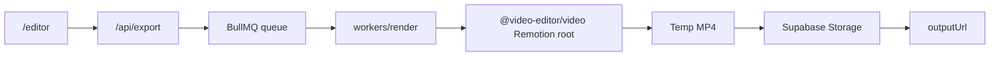

# Render Job Flow

The production render path is:

1. `/editor` saves the canonical timeline project.
2. `POST /api/export` validates the `@video-editor/timeline-schema` project and enqueues it in BullMQ.
3. `workers/render` consumes the job, bundles the Remotion root from `@video-editor/video`, and renders the project.
4. The worker uploads the MP4 to Supabase Storage under `renders/<projectId>/<jobId>.mp4`.
5. The queued job resolves with the public output URL.

Notes:

- The canonical render input is `{ project }` from `@video-editor/timeline-schema`.
- `/editor` hydrates recent and active job status from `GET /api/render-jobs`.
- `packages/video` owns the composition and render metadata.
- `packages/preview-renderer` stays preview-only and should mirror the same clip resolution rules.
